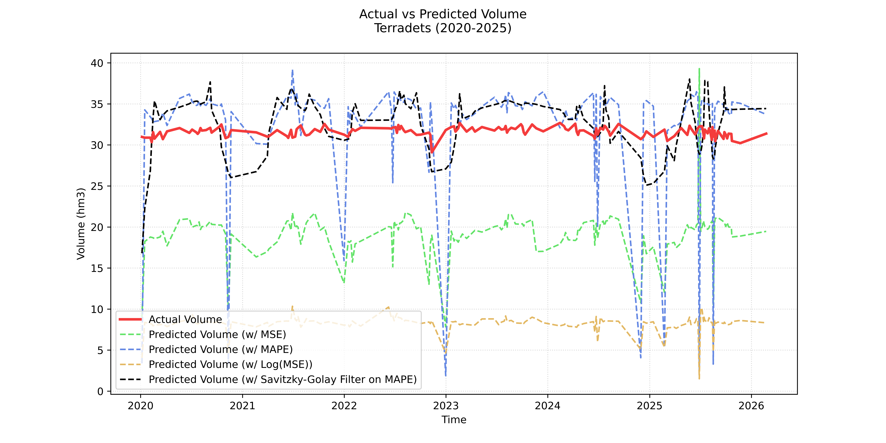

### Data

For each one of the 9 internal water reservoirs in Catalunya:
- [Sentinel-2 data - Copernicus](https://dataspace.copernicus.eu/).
- [Daily volume ($hm^3$) - Agència Catalana de l'Aigua](https://analisi.transparenciacatalunya.cat/Medi-Ambient/Quantitat-d-aigua-als-embassaments-de-les-Conques-/gn9e-3qhr/about_data).

---

### Time Period
At the moment 2020-2026, but we can consider expanding it from 2016 to 2026.

---

### Getting the Sentinel-2 Data
- We generate a dictionary with the lat/lon of each of the 9 reservoirs, as well as the window (in km) to be retrieved.
- To test out the windows and verify that no reservoir is accidentally cropped, we use the API to get recent RGB images and visually inspect them (`data/window_checks`).
- We iterate over the reservoirs and the years, and for each year we obtain the dates with data available and with almost no cloud cover. We compute and download the NDWI for all the valid dates. 

---

### Getting the Volume Ground Truth
We iterate over all the .tiff downloaded, and for each one of them, we look for the correspondent volume label in the daily capacity .csv file.

---

### Train-Validation-Test Split
In this very case, the train-test split must be done by geography, not time. If we use time, the Neural Network will memorize the topography of each reservoir and use it for prediction, failing to generalize for unseen data.

- Train: 7 dams
- Validation: 1 dam
- Test: 1 dam

---

### Standarizing the Tensors
Currently, our tensors (images) have only 1 channel (since there's only 1 value computed per pixel), but varying heights and widths. Somehow, we need to homogenize their dimensions. We opt for padding to exactly 500x500 (the bigger image in the dataset) using -1.0 (Dry Land).

---

### Architecture

##### BLOCK 1
- Input is (1, 500, 500) -> Output is (16, 250, 250).
- Convolution (kernel_size=3 and padding=1), ReLU, Max. Pooling (2x2).

##### BLOCK 2
- Input is (16, 250, 250) -> Output is (32, 125, 125).
- Convolution (kernel_size=3 and padding=1), ReLU, Max. Pooling (2x2).

##### BLOCK 3
- Input is (32, 125, 125) -> Output is (64, 62, 62).
- Convolution (kernel_size=3 and padding=1), ReLU, Max. Pooling (2x2).

##### BLOCK 4
- Input is (64, 62, 62) -> Output is (128, 31, 31).
- Convolution (kernel_size=3 and padding=1), ReLU, Max. Pooling (2x2).

##### GLOBAL AVERAGE POOLING
- To destroy spatial memorization, we turn each of the 31x31 pixel maps into a scalar.

##### LINEAR LAYER + ReLU
- Input is (128, 1, 1) -> Output is (256, 1, 1)
- ReLU

##### FINAL LINEAR LAYER
- Input is (256, 1, 1) -> Output is (1, 1, 1) (1 scalar)

---

### Loss Function
We use three different specifications for the loss function:
- Mean Squared Error (MSE). We build a good model for big reservoirs, but not so good for medium- and small-sized ones.
- Mean Absolute Percentage Error (MAPE), which penalizes severely small absolute errors in medium- and small-sized reservoirs.
- Log(MSE).

---

### Results

| Method | Train Loss | Validation Loss | Test Loss |
|----------|-----------|-----------|-----------|
| MSE  | 0.0005   | 0.0004   | 0.0003  |
| MAPE  | 7.80%   | 514.98%   | 262.05%   |

---

### Test on Terradets Reservoir*

_*Note that Terradets reservoir is not included in either of the train, validate,or datasets._
