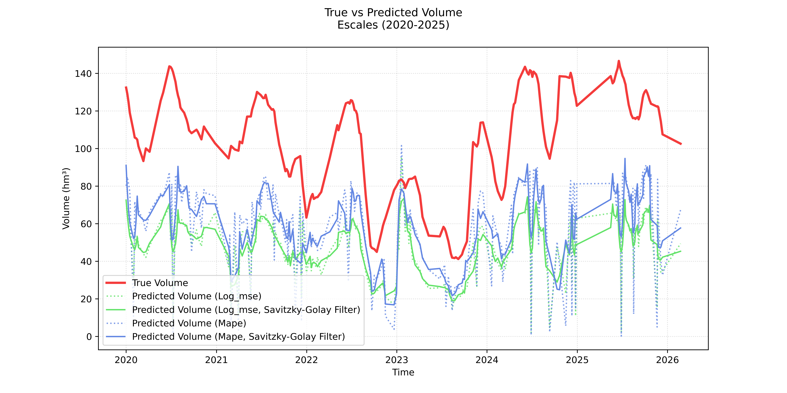
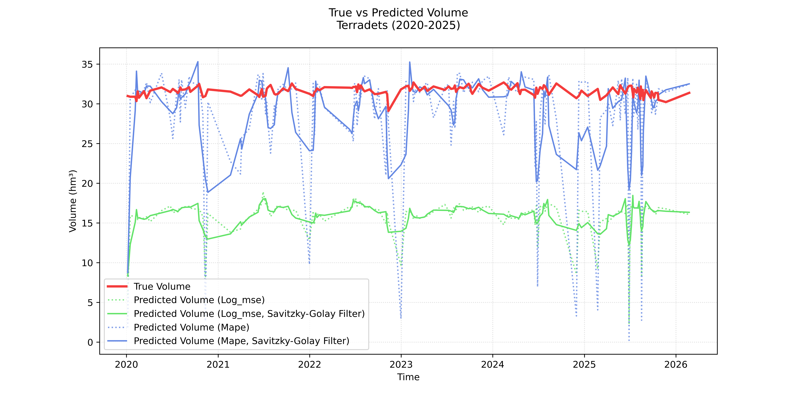

# Predicting Water Volume in Reservoirs using Satellite Imagery in Catalonia

> Eric Gutiérrez, March 2026.

## Motivation
Climate change, through the many externalities it brings, poses a serious threat to societies around the globe. Beyond the causes of this global phenomenon and the potential mitigation measures that could be taken, governments and organizations worldwide are focusing on resilience and adaptability. In our case, we are interested in how to better inform public policy in the realm of water management, and how having reliable data is key to effectively planning and acting towards resilience.

Specifically, we aim to provide a Computer Vision model that predicts water reservoir volumes using satellite imagery. This mission is relevant not only for "data-poor" environments, where official measurements are non-existent, but also for "data-rich" environments, where a remote-sensing solution could provide valuable redundancy. Additionally, it could serve as a fact-checking mechanism for official records, an application of great relevance today amid threats to democracy and increasing citizen mistrust of public institutions.

## Data
The dataset integrates [Sentinel-2 multispectral imagery](https://dataspace.copernicus.eu/) with [daily volumetric records](https://analisi.transparenciacatalunya.cat/Medi-Ambient/Quantitat-d-aigua-als-embassaments-de-les-Conques-/gn9e-3qhr/about_data) ($hm^3$) from the Agència Catalana de l’Aigua (ACA) for nine Catalan reservoirs over the 2016–2026 period. To standardize inputs across varying basin sizes, a dynamic window generator was developed to convert kilometer-based windows into decimal degrees, ensuring all data was retrieved at a fixed 20m/pixel resolution via the Copernicus Data Space Ecosystem (CDSE) API. Observations were strictly filtered for $\le 15\%$ cloud cover, and the Normalized Difference Water Index (NDWI) was computed server-side to isolate surface water signatures using the green band (B03) and the Near-Infrared Band (B08) as follows:

$$NDWI = \dfrac{B03 - B08}{B03 + B08}$$

For model training, a custom dataset class was implemented to transform raw GeoTIFFs into model-ready tensors through a pre-processing pipeline. The class reclassifies NaNs as $-1.0$ (representing dry land) and clips spectral values to a $[-1.0, 1.0]$ range before zero-padding all inputs to a uniform 500x500 spatial tensor. Furthermore, the dataset supports dual label-scaling modes to facilitate different optimization strategies: a logarithmic $\log(V + 1)$ transformation for Log-MSE experiments and a linear $1/300$ scaling factor to normalize volumes for MAPE training. This architecture ensures spatial consistency and numerical stability across the entire multi-reservoir ensemble.

Finally, we matched each GeoTIFF with it's correspondent true water volume from the ACA dataset.

> Please refer to the notebooks `get_sentinel-2.ipynb` and `get_labels.ipynb` for the source code regarding the downloading/processing of Sentinel-2 data and the matching of ground-truth labels, respectively. For the implementation of the custom dataset, please refer to the notebook `cnn_loocv.ipynb`.

## Methodology

### Architecture

To accurately predict reservoir volumes from satellite imagery, the model must be capable of understanding the 2D topographical footprint and morphological features of the water bodies. Standard Multi-Layer Perceptrons (MLPs) inherently flatten spatial inputs, destroying the geometric relationships between neighboring pixels. To overcome this limitation, a custom Convolutional Neural Network (CNN) architecture, denoted as DamCNN, was designed to sequentially extract localized spatial features from the Normalized Difference Water Index (NDWI) matrices before performing continuous regression.

The network is structured into three distinct phases: a hierarchical feature extractor, a spatial pooling bottleneck, and a fully connected regression head.

#### Hierarchical Feature Extraction
  
The input to the network is a standardized, zero-padded NDWI tensor with dimensions of 1x500x500. The feature extraction phase consists of four sequential convolutional blocks. Each block applies a 2D Convolutional layer with a 3x3 kernel and a padding of 1 to preserve spatial dimensions, followed immediately by a non-linear ReLU activation function. To progressively downsample the spatial resolution while increasing the depth of the feature maps, a 2x2 Max Pooling layer (with a stride of 2) concludes each block. Through this sequence, the network expands its feature channels from 1 to 16, 32, 64, and finally 128, while compressing the spatial dimensions from 500x500 down to a 31x31 feature map.

#### Global Average Pooling
  
A critical challenge in training a CNN on varied reservoir shapes is preventing the network from memorizing the absolute spatial location of water pixels within the 500x500 grid. To enforce spatial invariance and prevent overfitting to specific valley coordinates, an Adaptive Global Average Pooling layer (1x1) is applied after the final convolutional block. This operation collapses the 128 feature maps of 31x31 pixels into exactly 128 spatially-agnostic numeric representations. This forces the model to base its predictions on the presence and shape of topological features, rather than their explicit location in the frame.

#### Regression Head
  
The resulting 128-dimensional vector is flattened and passed into a fully connected feed-forward regression head. The first linear layer maps the 128 features to a hidden layer of 256 neurons, activated by a ReLU function to model complex non-linear relationships. Finally, a concluding linear layer outputs a single continuous value, representing the predicted volume of the reservoir.

### Leave-One-Reservoir-Out Cross-Validation
Standard random-split cross-validation suffers from severe data leakage when applied to spatio-temporal remote sensing datasets. If satellite images of the same reservoir from different dates appear in both the training and validation sets, the model is highly susceptible to temporal autocorrelation. Under these conditions, the network tends to memorize the static background pixels of a specific valley rather than learning the underlying geometric relationship between the water's surface area and its true volume.

To evaluate the model's spatial generalization capabilities and prove generalization to unseen topographies, a Leave-One-Reservoir-Out Cross-Validation strategy was implemented. The dataset comprises 9 distinct reservoirs. In each of the 9 folds, a new model instance is initialized and trained entirely on the chronological imagery of the other 8 reservoirs. The model is then validated exclusively on the completely unseen 9th reservoir. This strict spatial boundary guarantees that the validation metrics reflect genuine topographical learning rather than spatial memorization.

To ensure the training process was continuously monitored and to strictly prevent overfitting, the network was explicitly evaluated on the left-out validation set at the conclusion of every epoch. Because the geometric complexity and difficulty of generalization vary significantly depending on which specific reservoir is left out, setting a fixed number of training epochs would inevitably cause some folds to underfit and others to overfit.

To address this, a dynamic Early Stopping mechanism was integrated into the training loop. During each epoch, the validation error was tracked. If the model's performance on the unseen validation reservoir failed to improve for 15 consecutive epochs (a patience of 15), training was automatically halted. The model weights from the optimal epoch were then restored and saved.

### Hyperparameter Tuning and Loss Function Optimization

A fundamental challenge in training a global regression model for hydrological monitoring is the extreme variance in reservoir capacities. The dataset contains basins with drastically different maximum volumes, ranging from relatively small local dams ($\sim 10 \ hm^3$) to massive regional reservoirs ($>130 \ hm^3$). Consequently, the selection of an appropriate loss function and target scaling mechanism was treated as a primary hyperparameter.

Initially, to handle this massive scale discrepancy, the target volume labels were log-transformed ($log(V + 1)$), and the network was trained using Mean Squared Error in the logarithmic space (Log-MSE). While this transformation successfully compressed the target distribution and prevented the network from disproportionately prioritizing the largest reservoirs, it introduced a critical vulnerability during inference. Optimizing in the logarithmic space meant that even minor prediction errors made by the network were exponentially magnified when the outputs were mathematically reversed back into physical cubic hectometers ($hm^3$). This led to unstable and heavily skewed volume predictions when testing on out-of-distribution topographies.

To achieve scale invariance and resolve this extrapolation bias, we pivoted to Mean Absolute Percentage Error (MAPE), defined as:
$$MAPE = \frac{1}{N} \sum_{i=1}^{N} \left| \frac{y_i - \hat{y}_i}{y_i + \epsilon} \right|$$

where $y_i$ represents the true volume, $\hat{y}_i$ represents the predicted volume, $N$ is the batch size, and $\epsilon$ is a strictly positive constant ($1 \times 10^{-8}$) applied to prevent division by zero. By normalizing the absolute error by the true volume, MAPE forces the Convolutional Neural Network to evaluate performance on a relative scale. Under this paradigm, a 10% error is weighted equally regardless of whether the physical reservoir holds $10 \ hm^3$ or $100 \ hm^3$, forcing the model to learn generalized topographical relationships rather than simply defaulting to large numeric outputs.

To facilitate stable gradient descent across these complex loss landscapes, the network weights were updated using the Adam optimizer with a learning rate of 0.001. A batch size of 32 was deliberately selected; this provided a sufficient sample of varied topographies per forward pass to maintain stable gradient updates, while strictly adhering to the GPU memory constraints required to process high-resolution 1x500x500 spatial tensors.

> Please refer to the notebook `cnn_loocv.ipynb` for the source code regarding this section.

## Results

In Table 1, we show the train and validation loss, as well as the early-stopping epoch, for each fold and loss model. The results highlight a stark contrast in training dynamics between the two loss functions, with the Log-MSE model requiring an average of nearly 40 epochs to converge, whereas the optimized MAPE model stabilized significantly faster at an average of just 15 epochs. By penalizing relative percentage errors rather than absolute squared errors, the MAPE formulation prevented the network from obsessively over-optimizing for the largest reservoirs, allowing it to rapidly extract generalized topographical rules without memorizing specific valley geometries. 

Furthermore, the consistent trend of validation losses remaining lower than or comparable to training losses across the folds demonstrates that the cross-validation strategy successfully mitigated spatial overfitting. Ultimately, the MAPE architecture achieved a global mean validation error of 28.4% on completely unseen basins.

<table style="width=100%">
  <thead>
    <tr>
      <th rowspan="2">Left-Out Reservoir</th>
      <th colspan="3" style="text-align: center">Log-MSE Model</th>
      <th colspan="3" style="text-align: center">MAPE Model</th>
    </tr>
    <tr>
      <th>Train Loss</th>
      <th>Val Loss</th>
      <th>Epoch</th>
      <th>Train Loss</th>
      <th>Val Loss</th>
      <th>Epoch</th>
    </tr>
  </thead>
  <tbody>
    <tr>
      <td><strong>Baells</strong></td>
      <td>0.1227</td><td>0.1326</td><td>19</td>
      <td>0.3503</td><td>0.1374</td><td>25</td>
    </tr>
    <tr>
      <td><strong>Boadella</strong></td>
      <td>0.0996</td><td>0.0544</td><td>31</td>
      <td>1.3986</td><td>0.3506</td><td>1</td>
    </tr>
    <tr>
      <td><strong>Foix</strong></td>
      <td>0.3777</td><td>0.0319</td><td>3</td>
      <td>0.4570</td><td>0.4113</td><td>13</td>
    </tr>
    <tr>
      <td><strong>Llosa de Cavall</strong></td>
      <td>0.0366</td><td>0.0260</td><td>99</td>
      <td>0.3085</td><td>0.1677</td><td>18</td>
    </tr>
    <tr>
      <td><strong>Riudecanyes</strong></td>
      <td>0.0742</td><td>0.0704</td><td>47</td>
      <td>0.4928</td><td>0.5191</td><td>3</td>
    </tr>
    <tr>
      <td><strong>Sant Ponç</strong></td>
      <td>0.0695</td><td>0.0172</td><td>45</td>
      <td>0.5458</td><td>0.1611</td><td>9</td>
    </tr>
    <tr>
      <td><strong>Sau</strong></td>
      <td>0.0995</td><td>0.1277</td><td>24</td>
      <td>0.2585</td><td>0.1880</td><td>32</td>
    </tr>
    <tr>
      <td><strong>Siurana</strong></td>
      <td>0.0821</td><td>0.1702</td><td>40</td>
      <td>0.4791</td><td>0.3814</td><td>14</td>
    </tr>
    <tr>
      <td><strong>Susqueda</strong></td>
      <td>0.0624</td><td>0.0494</td><td>51</td>
      <td>0.3185</td><td>0.2393</td><td>21</td>
    </tr>
    <tr>
      <td><strong>Global Mean</strong></td>
      <td><strong>0.1138</strong></td><td><strong>0.0755</strong></td><td><strong>39.89</strong></td>
      <td><strong>0.5121</strong></td><td><strong>0.2840</strong></td><td><strong>15.11</strong></td>
    </tr>
  </tbody>
</table>

<u>Table 1</u>.
In-Distribution Performance Metrics for Leave-One-Reservoir-Out Cross-Validation. The table presents the final training loss, validation loss, and the specific epoch at which the dynamic Early Stopping mechanism (patience = 15) halted training for each left-out reservoir fold. Results are provided for both the initial Log-MSE model and the optimized MAPE model. Note: Log-MSE and MAPE represent the optimization metrics used during training and operate on fundamentally different mathematical scales (logarithmic absolute error vs. relative percentage error); therefore, their raw loss values are not directly comparable to one another.

### Test on Unseen Reservoirs

To rigorously validate the models's generalization against out-of-distribution topographies, the final evaluation phase subjects the networks to a strict stress test using two completely unseen reservoirs sourced from an external dataset. This phase systematically compares the extrapolation capabilities of both the Log-MSE and MAPE formulations to determine which loss function best adapts to unprecedented geometric scales. 

<table>
  <thead>
    <tr>
      <th rowspan="2">Unseen Reservoir</th>
      <th colspan="2">Log-MSE Ensemble</th>
      <th colspan="2">MAPE Ensemble</th>
    </tr>
    <tr>
      <th>Average Error (hm³)</th>
      <th>Average Error (%)</th>
      <th>Average Error (hm³)</th>
      <th>Average Error (%)</th>
    </tr>
  </thead>
  <tbody>
    <tr>
      <td><strong>Escales</strong></td>
      <td>57.05</td><td>53.38</td>
      <td>46.11</td><td>42.93</td>
    </tr>
    <tr>
      <td><strong>Terradets</strong></td>
      <td>15.59</td><td>49.30</td>
      <td>3.68</td><td>11.67</td>
    </tr>
  </tbody>
</table>

<u>Table 2</u>.
Generalization and Out-of-Distribution Performance of the 9-Model Ensembles. This table evaluates the extrapolation capabilities of both the Log-MSE and MAPE ensembles when applied to completely unmonitored reservoirs (Escales and Terradets). Performance is measured using Mean Absolute Error (MAE) in physical volume ($hm^3$) and Mean Absolute Percentage Error (%). These results isolate the effect of the loss function on the ensemble's ability to generalize topographical relationships to novel basin geometries that were entirely absent from the training distribution.

The results in Table 2 demonstrate the superior performance upon generalization of the MAPE Ensemble compared to the Log-MSE approach when applied to entirely unseen reservoirs. By optimizing for relative percentage error during the training phase, the MAPE architecture successfully learned to separate 2D surface area signatures from absolute volumetric magnitudes, allowing it to adapt to novel topographies with significantly higher precision. While the Log-MSE model suffered from a persistent scale-dependent bias —resulting in relative errors hovering near 50% for both basins— the MAPE Ensemble achieved a substantial reduction in both absolute and relative error.

The performance disparity is most pronounced in the Terradets reservoir, where the MAPE Ensemble achieved a remarkable 11.67% average error, effectively neutralizing the "extrapolation trap" that led the Log-MSE model to a much higher 49.30% error. In the case of Escales, although both models encountered greater predictive difficulty, the MAPE Ensemble still provided a 10.45% improvement in relative accuracy over its counterpart. These findings suggest that while absolute error naturally scales with reservoir size, the MAPE-trained architecture preserves a robust geometric understanding of the area-volume relationship, maintaining operational utility even when faced with topographies that deviate significantly from the training distribution.

<u>Figure 1</u>.
Temporal Volume Estimation for the Escales Reservoir (2020–2025). Comparison between ground-truth volume (red) and ensemble predictions. The Log-MSE ensemble (green) consistently underpredicts the volume, while the MAPE ensemble (blue) captures the seasonal fluctuations better, but with a systematic negative bias. The solid lines represent the application of the Savitzky-Golay filter ($window=7$, $poly=2$), effectively removing high-frequency noise from raw satellite observations.

<u>Figure 2</u>.
Temporal Volume Estimation for the Terradets Reservoir (2020–2025). Out-of-distribution validation results. The MAPE-trained ensemble (blue) demonstrates good generalization capabilities, converging on the true volume ($\sim 31 \ hm^3$) with high accuracy after temporal smoothing. Conversely, the Log-MSE model (green) suffers from a significant magnitude collapse, underpredicting the true volume by approximately 50%, highlighting the limitations of logarithmic compression for scale-varying basins.

The temporal analysis displayed in Figures 1 and 2 reveals two critical findings regarding the model’s real-world utility. First, the raw predictions (dotted lines) from both architectures exhibit high volatility, characterized by sharp "spikes" that do not correspond to physical hydrological changes. These can be attributed to atmospheric interference and varying sensor angles in the Sentinel-2 imagery. The integration of the Savitzky-Golay filter proves essential; it successfully isolates the underlying hydrological signal from the mathematical noise, producing a smoothed curve that tracks the seasonal filling and emptying cycles of the reservoirs without the lag associated with simple moving averages.

Second, the results illustrate a clear performance-by-scale hierarchy. In the case of Terradets, which maintains a stable volume near 30 $hm^3$, the MAPE ensemble achieves nearly perfect alignment with the ground truth. This suggests that the 1/300 normalization used during training allowed the network to master this specific volumetric scale. In Escales, however, while the MAPE ensemble accurately reflects the timing and direction of every major volume shift, it displays a systematic underprediction bias. This "scale-lag" occurs because Escales often exceeds 120 $hm^3$, a range that is underrepresented in the training set. Despite this offset, the MAPE model significantly outperforms the Log-MSE model, proving that the MAPE formulation is far more robust for cross-basin generalization.

> Please, refer to the notebooks `prediction_ensemble.ipynb` and `plots.ipynb` for the source code regarding the construction of the ensemble and posterior prediction, and the visualization, respectively.

## Conclusions
The motivation for this research is rooted in the urgent need for climate resilience; as global water management becomes increasingly complex, reliable data is the essential cornerstone for effective public policy. This project addressed this need by developing a Computer Vision framework to predict reservoir volumes using Sentinel-2 satellite imagery, offering a scalable solution for both "data-poor" environments lacking ground infrastructure and "data-rich" regions requiring independent redundancy. By successfully training an ensemble of CNNs to extract volumetric capacity from 2D spectral signatures, this work establishes a non-invasive fact-checking mechanism. Such an independent audit tool is of profound relevance today, serving as a safeguard for institutional transparency and a means to mitigate the growing citizen mistrust of public data through verifiable, remote-sensing evidence.

Regarding the model's generalization, a transparent assessment reveals that while the MAPE Ensemble accurately tracks the timing and direction of hydrological cycles, it is not yet a reliable replacement for physical sensors. The generalization tests on the Escales and Terradets basins uncovered a persistent Scale-Bias, where the model accurately captured topographical physics but struggled to estimate the absolute magnitude of reservoirs larger than those in the training distribution. Despite this limitation, the system remains a powerful tool to complement official records from the Agència Catalana de l’Aigua (ACA). By providing a smoothed, satellite-based "digital twin" to official data, this framework proves that deep learning can provide the reliable, independent oversight necessary to inform policy and strengthen hydrological resilience on a global scale.